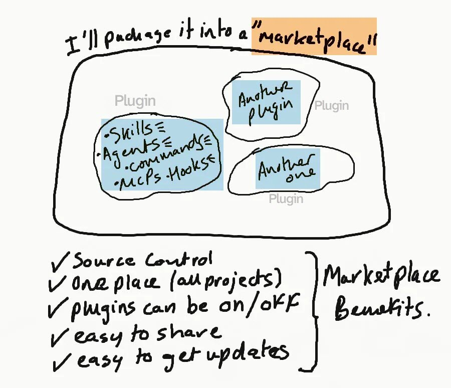

# My Claude Marketplace (A Bag of Plugins)

<figure align="center">
  <a href="images/marketplace-plugin-sketch.jpeg" target="_blank">
    
  </a>
  <figcaption><em>A Marketplace is a "Bag of Plugins". A plugin can contain skills, among other things.</em></figcaption>
</figure>

## Plugins In This Marketplace

| Plugin | Type | Purpose |
| :----- | :--- | :------ |
| [claude-code-utils](./plugins/claude-code-utils) | 3 skills | Claude Code know-how + session analysis |
| [find-font](./plugins/find-font) | 4 skills + MCP | Font pairing (orchestrator pattern) |
| [nextjs-utils](./plugins/nextjs-utils) | 2 skills + MCP | Next.js docs & dev guidance |
| [git-utils](./plugins/git-utils) | 5 skills | Git & GitHub workflows |
| [my-conventions](./plugins/my-conventions) | 3 skills | Personal conventions: uv scripts, plugin management, grilling |

## Installation - User Scope

First, add the marketplace:

```
/plugin marketplace add michellepace/my-claude-marketplace
```

Then install a plugin:

```
/plugin install {plugin-name}@my-claude-marketplace
```

Or browse available plugins, run `/plugin` > Marketplace > Select "my-claude-marketplace" > Browse Plugins > Install...

## Installation - Project Scope

Commit plugin configuration to the repo so every collaborator gets the same setup. Register a marketplace and install plugins at project scope:

```bash
# 1. Add Marketplace (writes "extraKnownMarketplaces")
claude plugin marketplace add michellepace/my-claude-marketplace --scope project

# 2. Install Plugin (writes "enabledPlugins") or run `/plugin`
claude plugin install git-utils@my-claude-marketplace --scope project

# 3. Additional Marketplace and Two Plugins
claude plugin marketplace add anthropics/claude-plugins-official --scope project
claude plugin install skill-creator@claude-plugins-official --scope project
claude plugin install plugin-dev@claude-plugins-official --scope project
```

Both commands write to [.claude/settings.json](.claude/settings.json):

```json
{
  "extraKnownMarketplaces": {
    "my-claude-marketplace": {
      "source": {
        "source": "github",
        "repo": "michellepace/my-claude-marketplace"
      }
    },
    "claude-plugins-official": {
      "source": {
        "source": "github",
        "repo": "anthropics/claude-plugins-official"
      }
    }
  },
  "enabledPlugins": {
    "git-utils@my-claude-marketplace": true,
    "skill-creator@claude-plugins-official": true,
    "plugin-dev@claude-plugins-official": true
  }
}
```

To disable, uninstall, or remove **plugins** at project scope use: Claude Code terminal > `/plugins` > ...

> **Note:** `claude plugin marketplace remove` does not support `--scope`. It removes the marketplace globally and uninstalls all its plugins. To remove a marketplace from project scope only, delete its `extraKnownMarketplaces` entry from `.claude/settings.json` manually. For everything else, stick to `/plugins` interface.

---

## Appendix

### 1. About Plugin Scope

Plugins can be enabled at four scope levels. The override order (highest to lowest) is: managed > local > project > user.

| Scope | Settings File | Who it affects | Shared with team? |
| :---- | :------------ | :------------- | :---------------- |
| **managed** | `managed-settings.json` (system) | All users on the machine | Yes (deployed by IT) |
| **local** | `.claude/settings.local.json` | You, in this repo only | No (gitignored) |
| **project** | `.claude/settings.json` | All collaborators on the repo | Yes (committed to git) |
| **user** | `~/.claude/settings.json` | You, across all projects | No |

### 2. Developing Plugins

Test a plugin locally without installing:

```shell
claude --plugin-dir ~/projects/my-claude-marketplace/plugins/git-utils
```

`--plugin-dir` provides a temporary session override that takes precedence over all scopes (local, project, user) except managed — see table above.

Edit your files, run `/reload-plugins` (or restart Claude Code), test. No install/uninstall needed.
