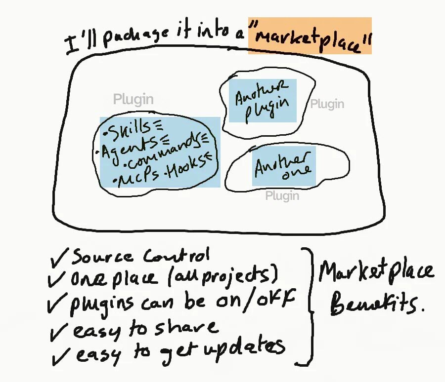
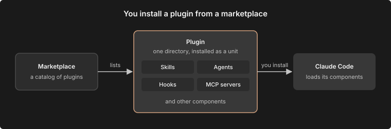
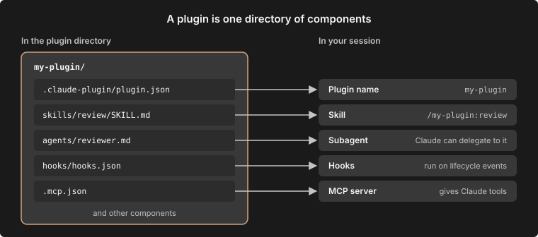

# My Claude Marketplace (A Bag of Plugins)

A marketplace is a bag of plugins — easy to share, easy to keep updated. Plugins most often contain skills, which are in essence "repeatable prompts". This repo is a marketplace of plugins I made for me.

<p>
  <a href="images/marketplace-plugin-sketch.jpeg"></a>
  <br>
  <sub><em>Marketplace → has Plugins → which can contain Skills (and other things)</em></sub>
</p>

## What's Inside?

Well yes you guessed it, plugins.

| Plugin | Contains | Purpose |
| :----- | :------- | :------ |
| [`alwayson-misc`](./plugins/alwayson-misc) | 4 skills | uv scripts, plugin management, grill-me, my VS Code profiles |
| [`claude-code-utils`](./plugins/claude-code-utils) | 3 skills | Claude Code know-how + session analysis |
| [`find-font`](./plugins/find-font) | 4 skills + MCP | Font pairing (orchestrator pattern) |
| [`git-utils`](./plugins/git-utils) | 5 skills | Git & GitHub workflows |
| [`nextjs-utils`](./plugins/nextjs-utils) | 2 skills + MCP | Next.js docs & dev guidance |

For what a plugin can contain, see [Anatomy of a Plugin](#appendix-anatomy-of-a-plugin).

## Usage

These commands use `project` scope, my default. The four scopes are explained below.

```bash
# add the marketplace
claude plugin marketplace add michellepace/my-claude-marketplace --scope project

# install any plugin, e.g. find-font
claude plugin install find-font@my-claude-marketplace --scope project
```

<br>

📚 **About that `--scope`:**

Plugins enabled in different scopes add up. If two scopes set the same plugin, the higher one wins: managed > local > project > user.

| Scope | Settings file | Who it affects | Shared with team? |
| :---- | :------------ | :------------- | :---------------- |
| **managed** | `managed-settings.json` (system) | All users on the machine | Yes (deployed by IT) |
| **local** | `.claude/settings.local.json` | You, in this repo only | No (gitignored) |
| **project** | `.claude/settings.json` | All collaborators on the repo | Yes (committed to git) |
| **user** | `~/.claude/settings.json` | You, across all projects | No |

I install at project scope so source control shows which plugins a project uses. I commit them disabled and enable them only when needed, to keep my context window clean.

## Appendix: Anatomy of a Plugin

Where a plugin fits, then what each of its files gives you once it loads:

<p>
  
  <br><br>
  
  <br>
  <sub><em>Both from the <a href="https://code.claude.com/docs/en/plugins/overview">Plugins overview</a> docs</em></sub>
</p>

Every component is optional and auto-discovered from its default location. Other files, such as `scripts/`, aren't loaded automatically; refer to them with `${CLAUDE_PLUGIN_ROOT}` (ask Claude why). The plugins in this repo are far simpler, but here is the full picture:

```text
my-plugin/
├── .claude-plugin/
│   └── plugin.json           # Manifest 🟢 (optional; only `name` is required)
├── skills/                   # Skills → /my-plugin:<skill>
│   └── review/
│       ├── SKILL.md
│       └── scripts/          # Supporting files for the skill
├── agents/                   # Subagents Claude can delegate to
│   └── security-reviewer.md
├── hooks/
│   └── hooks.json            # Hooks that run on lifecycle events (exact filename)
├── .mcp.json                 # MCP servers that give Claude tools
├── .lsp.json                 # Language servers
├── bin/                      # Executables on the Bash tool's PATH
│   └── hello-plugin
├── monitors/
│   └── monitors.json         # Background commands whose output reaches Claude
├── workflows/                # Dynamic workflow scripts "subagents at scale"
│   └── audit-routes.js
├── output-styles/            # Output styles → /output-style
│   └── terse.md
├── themes/                   # Color themes → /theme
│   └── dracula.json
├── settings.json             # Defaults; only `agent` and `subagentStatusLine` apply
└── scripts/                  # Not auto-loaded: helpers for hooks, via ${CLAUDE_PLUGIN_ROOT}
    └── format.sh
```

## Appendix: Good Refs

Three plugin components worth a closer look:

> *A [subagent](https://code.claude.com/docs/en/sub-agents) is a separate assistant, with its own instructions and context window, that Claude can delegate a task to. See [docs](https://code.claude.com/docs/en/plugins/components#agents).*

> *A monitor is a shell command that runs in the background for the whole session. What it prints reaches Claude as notifications, so Claude can react to a log or a status change without being asked to watch it. See [docs](https://code.claude.com/docs/en/plugins/components#monitors).*

> *Dynamic workflows orchestrate many subagents from a script Claude writes and you can rerun. Use them for codebase audits, large migrations, and cross-checked research. See [docs](https://code.claude.com/docs/en/workflows).*

Docs
- [Plugins overview](https://code.claude.com/docs/en/plugins/overview)
- [Add components to a plugin](https://code.claude.com/docs/en/plugins/components)
- [Plugin manifest reference](https://code.claude.com/docs/en/plugins/manifest-reference)
- [Orchestrate subagents at scale with dynamic workflows](https://code.claude.com/docs/en/workflows)

Plugins for building plugins
- [Plugin Developer Toolkit](https://claude.com/plugins/plugin-dev) (`plugin-dev@claude-plugins-official`)
- [Skill Creator](https://github.com/anthropics/claude-plugins-official/tree/main/plugins/skill-creator) (`skill-creator@claude-plugins-official`) — also creates and runs evals
  - Related reading: [*"Automating eval design and hillclimbing with Claude"*](https://claude.dev/blog/automating-eval-design-and-hillclimbing/)
