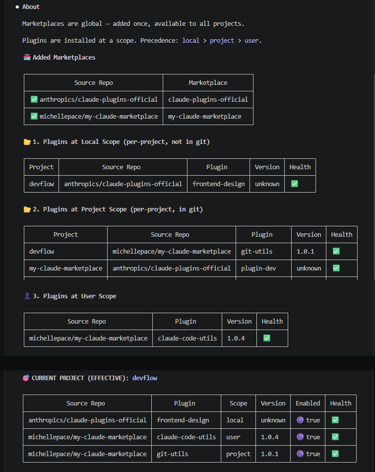
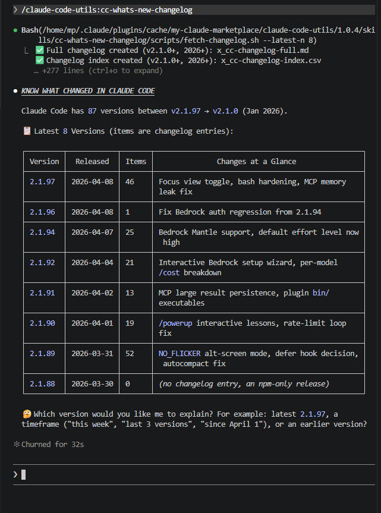

# Plugin: `claude-code-utils`

**Claude Code visibility & discovery:** Understand what is new in Claude Code from the changelog. Know which plugins you have installed and where.

To install this plugin:

```
# 1. Add marketplace if not already
/plugin marketplace add michellepace/my-claude-marketplace

# 2. Install this plugin
/plugin install claude-code-utils@my-claude-marketplace
```

## 🟣 What's Inside

| Run Skill | Description |
|:------|:------------|
| [`/cc-which-plugins`](skills/cc-which-plugins/SKILL.md) | Show all marketplaces and plugins with their status |
| [`/cc-whats-new-changelog`](skills/cc-whats-new-changelog/SKILL.md) | Analyse changelog and explain features practically |

---

## 🟣 Skill: cc-which-plugins

Shows the state of Marketplaces and Plugins across all scopes, with a focus on what's active in the current project.

Run:

```
/cc-which-plugins
```

### Sample Output

<div align="center">
  <a href="images/cc-which-plugins.jpg" target="_blank">
    
  </a>
</div>

---

## 🟣 Skill: cc-whats-new-changelog

Explains what's new in Claude Code versions with practical examples you can use immediately.

Run:

```
/cc-whats-new-changelog         # Summary table first
/cc-whats-new-changelog 2.1.2   # Exact version only
/cc-whats-new-changelog 2.1     # All 2.1.* versions
```

### Sample Output

Fetches the Claude Code changelog. Ask Claude to explain any version (earlier than in the table is possible too). The skill then launches the `claude-code-guide` subagent for rich, practical explanations with examples and doc links.

<div align="center">
  <a href="images/cc-whats-new-changelog.jpg" target="_blank">
    
  </a>
</div>
