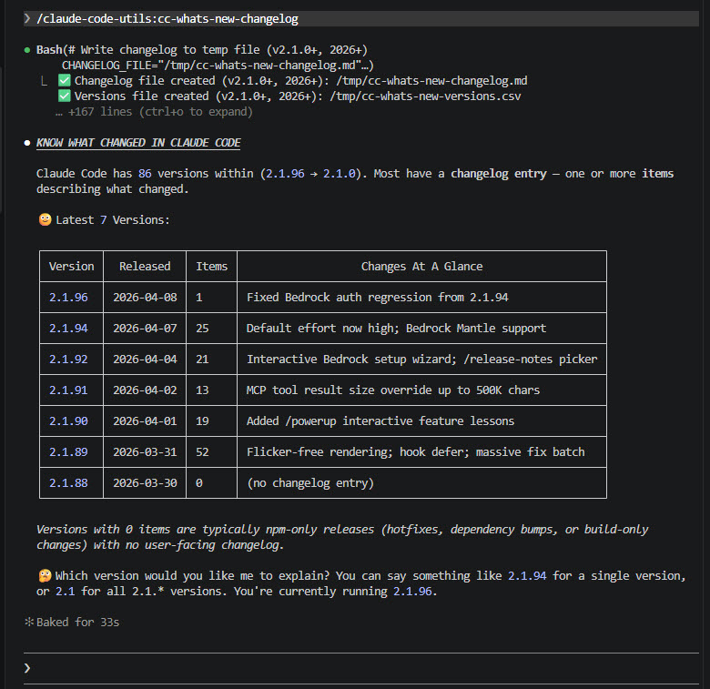

# Plugin: `claude-code-utils`

**Claude Code visibility & discovery:** Understand what is new in Claude Code from the changelog. Know which plugins you have installed and where.

To install this plugin:

```
# 1. Add marketplace if not already
/plugin marketplace add michellepace/my-claude-marketplace

# 2. Install this plugin
/plugin install claude-code-utils@my-claude-marketplace
```

## 🟣 What's Inside

| Run Skill | Description |
|:------|:------------|
| [`/cc-which-plugins`](skills/cc-which-plugins/SKILL.md) | Show all marketplaces and plugins with their status |
| [`/cc-whats-new-changelog`](skills/cc-whats-new-changelog/SKILL.md) | Analyse changelog and explain features practically |

---

## 🟣 Skill: cc-which-plugins

Shows the state of Marketplaces and Plugins across all scopes, with a focus on what's active in the current project.

### Usage

```
/cc-which-plugins
```

### Sample Output

```text
● All health checks pass. Here's the summary:

🏪 Added Marketplaces
  ┌───────────────────────────────────────┬─────────────────────────┐
  │              Source Repo              │       Marketplace       │
  ├───────────────────────────────────────┼─────────────────────────┤
  │ ✅ anthropics/claude-plugins-official │ claude-plugins-official │
  ├───────────────────────────────────────┼─────────────────────────┤
  │ ✅ michellepace/my-claude-marketplace │ my-claude-marketplace   │
  └───────────────────────────────────────┴─────────────────────────┘

📂 Plugins at Local Scope (per-project, not in git)
  (none)

📂 Plugins at Project Scope (per-project, in git)
  ┌───────────────────────┬────────────────────────────────────┬───────────────┬─────────┬────────┐
  │        Project        │            Source Repo             │    Plugin     │ Version │ Health │
  ├───────────────────────┼────────────────────────────────────┼───────────────┼─────────┼────────┤
  │ my-claude-marketplace │ anthropics/claude-plugins-official │ plugin-dev    │ unknown │ ✅     │
  ├───────────────────────┼────────────────────────────────────┼───────────────┼─────────┼────────┤
  │ my-claude-marketplace │ anthropics/claude-plugins-official │ skill-creator │ unknown │ ✅     │
  ├───────────────────────┼────────────────────────────────────┼───────────────┼─────────┼────────┤
  │ my-claude-marketplace │ michellepace/my-claude-marketplace │ git-utils     │ 1.0.0   │ ✅     │
  └───────────────────────┴────────────────────────────────────┴───────────────┴─────────┴────────┘

👤 Plugins at User Scope
  ┌────────────────────────────────────┬─────────────────┬─────────┬────────┐
  │            Source Repo             │     Plugin      │ Version │ Health │
  ├────────────────────────────────────┼─────────────────┼─────────┼────────┤
  │ anthropics/claude-plugins-official │ frontend-design │ unknown │ ✅     │
  └────────────────────────────────────┴─────────────────┴─────────┴────────┘

🎯 CURRENT PROJECT (EFFECTIVE): my-claude-marketplace
  ┌────────────────────────────────────┬─────────────────┬─────────┬─────────┬────────┐
  │            Source Repo             │     Plugin      │  Scope  │ Version │ Health │
  ├────────────────────────────────────┼─────────────────┼─────────┼─────────┼────────┤
  │ anthropics/claude-plugins-official │ frontend-design │ user    │ unknown │ ✅     │
  ├────────────────────────────────────┼─────────────────┼─────────┼─────────┼────────┤
  │ anthropics/claude-plugins-official │ plugin-dev      │ project │ unknown │ ✅     │
  ├────────────────────────────────────┼─────────────────┼─────────┼─────────┼────────┤
  │ anthropics/claude-plugins-official │ skill-creator   │ project │ unknown │ ✅     │
  ├────────────────────────────────────┼─────────────────┼─────────┼─────────┼────────┤
  │ michellepace/my-claude-marketplace │ git-utils       │ project │ 1.0.0   │ ✅     │
  └────────────────────────────────────┴─────────────────┴─────────┴─────────┴────────┘                 
```

---

## 🟣 Skill: cc-whats-new-changelog

Explains what's new in Claude Code versions with practical examples you can use immediately.

### Usage

```
/cc-whats-new-changelog 2.1      # All 2.1.* versions
/cc-whats-new-changelog 2.1.2    # Exact version only
```

### Sample Output

Fetches the Claude Code changelog. Ask Claude to explain any version (earlier than in the table is possible too). The skill then launches the `claude-code-guide` subagent for rich, practical explanations with examples and doc links.

<div align="center">
  <a href="../../images/cc-whats-new-changelog.jpg" target="_blank">
    
  </a>
</div>
