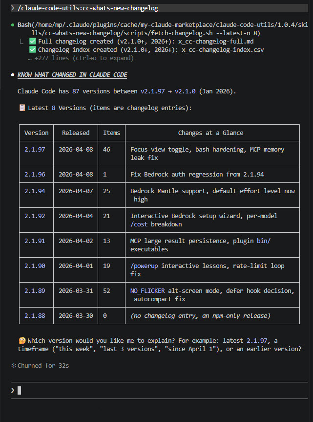

# Plugin: `claude-code-utils`

**Claude Code release notes & shortcut keys, plus analysis of your own sessions.**

Add marketplace and install (project scope):

```bash
# 1. Add Marketplace
claude plugin marketplace add michellepace/my-claude-marketplace --scope project

# 2. Install Plugin "claude-code-utils"
claude plugin install claude-code-utils@my-claude-marketplace --scope project
```

## 🟣 What's Inside

| Run Skill | Description |
| :--- | :--- |
| [`/cc-whats-new-changelog`](skills/cc-whats-new-changelog/SKILL.md) | Explain any Claude Code release |
| [`/cc-peak-ctx-analyse`](skills/cc-peak-ctx-analyse/SKILL.md) | Analyse recent Claude Code sessions, peak context usage by default |
| [`/cc-shortcuts`](skills/cc-shortcuts/SKILL.md) | Find a Claude Code or VSCode shortcut key |

---

## 🟣 Skill: cc-whats-new-changelog

Opens with a summary table of recent releases. Choose any version, series or timeframe. The `claude-code-guide` subagent explains what changed, with practical examples and doc links.

Run:

```
/cc-whats-new-changelog         # Summary table first
/cc-whats-new-changelog 2.1.2   # Exact version only
/cc-whats-new-changelog 2.1     # All 2.1.* versions
```

### Sample Output

<div align="center">
  <a href="images/cc-whats-new-changelog.jpg" target="_blank">
    
  </a>
</div>

---

## 🟣 Skill: cc-peak-ctx-analyse

Scans your local session files (`~/.claude/projects/*/*.jsonl`) and computes each session's peak context-window size, the same value `/context` shows. That is the default report; ask about anything else in the data and it builds the report around your question.

Run:

```text
/cc-peak-ctx-analyse

/cc-peak-ctx-analyse what were my three biggest sessions
about this week?

/cc-peak-ctx-analyse today. In which session did I spend the
most time, and is duration correlated with context window size?

/cc-peak-ctx-analyse last 14 days. Am I getting better at
shorter context windows; any patterns between projects? I have
been trying very hard these last 3 days to get better at
managing my context. What are the trends?
```

---

## 🟣 Skill: cc-shortcuts

Ask in plain English for what you need, such as deleting a word, rewinding the conversation or dodging a VSCode chord conflict, and it returns the right key. It checks the plugin's curated notes first, which flag VSCode collisions, then Anthropic's interactive-mode reference.

Run:

```text
/cc-shortcuts how do I insert a newline without submitting?
/cc-shortcuts shortcut to rewind the conversation
/cc-shortcuts switch model without losing my prompt
```
