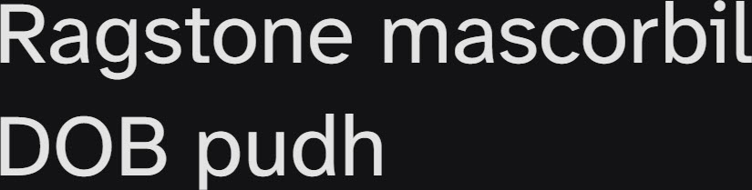

# Synopsis: Atkinson Hyperlegible Next

Refined version of Atkinson Hyperlegible developed specifically to increase legibility for readers with low vision and to improve reading comprehension. Traditional grotesque sans-serif at its core, departing from tradition with unambiguous, distinctive elements aimed at increasing character recognition.

## Key Characteristics

- **Classification:** Grotesque sans serif (accessibility-focused)
- **Character:** Unambiguous, distinctive letterforms — at times unexpected — engineered for character recognition and readability
- **Intended use:** Universal — body text and UI, especially for readers with low vision
- **Family:** Standalone family — no sibling serif or small caps companions
- **Adoption (2026-05-05):** 11.3M weekly serves, 1,900+ websites

## Technical

- **Variable font (1):** Weight (`wght`) 200–800
- **Weights:** 400
- **Styles:** Normal + Italic at 400

## Kupferschmid Matrix

Classified from visual examination of 

| Layer | Classification | Evidence |
| :---- | :------------- | :------- |
| 1 Skeleton | Quite Dynamic | Very open apertures on a/e/s/c (signature accessibility trait) pull Dynamic, but vertical stress on o/O pulls Rational |
| 2 Flesh | Linear Sans | Uniform stroke weight across curves, no serifs |
| 3 Skin | Open accessible grotesque | Tall ascenders on b/d/h/l, double-storey a with wide-open bottom aperture, flat-cut horizontal terminals on c/s for character disambiguation |

## References

Curated from:

- https://fonts.google.com/specimen/Atkinson+Hyperlegible+Next/about
- https://raw.githubusercontent.com/google/fonts/main/ofl/atkinsonhyperlegiblenext/METADATA.pb

Classified using:

- [kupferschmid-matrix.md](../references/kupferschmid-matrix.md)
