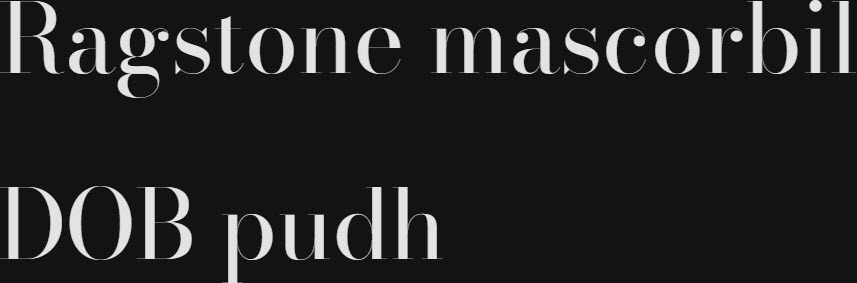

# Synopsis: Bodoni Moda

No-compromises Bodoni family built for the digital age, designed by Owen Earl (indestructible type*). Recreates the historical Bodoni bestseller with a full range of weights, italics, an extended character set, OpenType features, and optical sizes.

## Key Characteristics

- **Classification:** Serif (Bodoni / Modern Didone revival)
- **Character:** No-compromises Bodoni for the digital age; high-contrast modern serif with optical-size sensitivity
- **Intended use:** Versatile — supports a full range of weights, italics, OpenType features, and optical sizes
- **Family:** Standalone family — no sibling sans or small caps companions
- **Adoption (2026-04-29):** 123M weekly serves, 61,600+ websites

## Technical

- **Variable font (2):** Optical Size (`opsz`) 6–96, Weight (`wght`) 400–900
- **Weights:** 400–900 (variable)
- **Styles:** Normal + Italic

## Kupferschmid Matrix

Classified from visual examination of 

| Layer | Classification | Evidence |
| :---- | :------------- | :------- |
| 1 Skeleton | Rational | Closed apertures on a/e/s, strictly vertical stress on O, oval (non-circular) bowls on b/d/p |
| 2 Flesh | Contrast Serif | Extreme thick-thin contrast on curved strokes (a/g/o/e), fine unbracketed hairline serifs |
| 3 Skin | High-contrast Didone | Ball terminals on a/r, hairline flat serifs at baseline, tall ascenders with small x-height |

## References

Curated from:
- https://fonts.google.com/specimen/Bodoni+Moda/about
- https://raw.githubusercontent.com/google/fonts/main/ofl/bodonimoda/METADATA.pb

Classified using:
- [kupferschmid-matrix.md](../references/kupferschmid-matrix.md)
