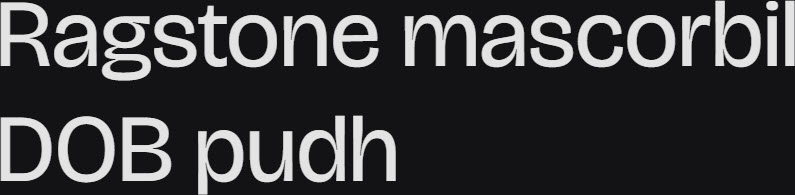

# Synopsis: Bricolage Grotesque

A collage typeface by Mathieu Triay that started as a fork of Mayenne Sans (Jérémy Landes / Studio Triple). Blends iconic British and French grotesque sources — the compressed weights lean towards the anxious, wonky tones of Grotesque Nº9, while the regular weights take on Antique Olive's relaxed, confident attitude. Smaller optical sizes become more neutral and reflective of contemporary sans serifs, notably through the use of exaggerated ink traps.

## Key Characteristics

- **Classification:** Sans serif (Display)
- **Character:** Hybrid grotesque collaging historical British and French sources with modern trends; expressive at compressed weights, relaxed at regular weights, neutral at small optical sizes
- **Intended use:** Display
- **Family:** Standalone family — no sibling serif or small caps companions
- **Adoption (2026-05-05):** 494M weekly serves, 4.32M+ websites

## Technical

- **Variable font (3):** Optical Size (`opsz`) 12–96, Width (`wdth`) 75–100, Weight (`wght`) 200–800
- **Weights:** 200–800 (variable axis)
- **Styles:** Normal

## Kupferschmid Matrix

Classified from visual examination of 

| Layer | Classification | Evidence |
| :---- | :------------- | :------- |
| 1 Skeleton | Quite Rational | Vertical stress on o/O pulls Rational, but moderately open apertures on a/e/c pull Dynamic — classic grotesque tension |
| 2 Flesh | Linear Sans | Uniform stroke weight across a/g/o/e, no serifs |
| 3 Skin | Hybrid grotesque proportions | Double-storey a and g, slightly squared bowl junctions on b/d/p, flat-cut terminals on c with round dot on i |

## References

Curated from:
- https://fonts.google.com/specimen/Bricolage+Grotesque/about
- https://raw.githubusercontent.com/google/fonts/main/ofl/bricolagegrotesque/METADATA.pb

Classified using:
- [kupferschmid-matrix.md](../references/kupferschmid-matrix.md)
