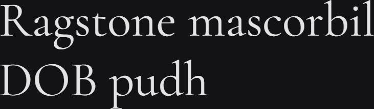

# Synopsis: Cormorant Garamond

Free display serif inspired by Claude Garamont's legacy. Ultra-high contrast with elegant, refined letterforms designed for large sizes. Part of the Cormorant super family spanning 9 visual styles.

## Key Characteristics

- **Classification:** Display serif (Garamond-inspired)
- **Character:** Ultra-high contrast, sharp elegant serifs, expressive calligraphic details — drawn from scratch with Garamond as a general impression rather than a direct reference
- **Intended use:** Display / headings (designed as a display face)
- **Family:** Cormorant super family — [Cormorant](https://fonts.google.com/specimen/Cormorant), [Cormorant Infant](https://fonts.google.com/specimen/Cormorant+Infant), [Cormorant SC](https://fonts.google.com/specimen/Cormorant+SC), [Cormorant Unicase](https://fonts.google.com/specimen/Cormorant+Unicase), [Cormorant Upright](https://fonts.google.com/specimen/Cormorant+Upright)
- **Adoption (2026-03-22):** 251M weekly Google Fonts serves, 420K+ websites

## Technical

- **Variable font (1):** Weight (`wght`) 300–700
- **Weights:** 300, 400, 500, 600, 700
- **Styles:** Normal + Italic at each weight

## Kupferschmid Matrix

Classified from visual examination of 

| Layer | Classification | Evidence |
| :---- | :------------- | :------- |
| 1 Skeleton | Dynamic | Open apertures on a/e/s/c, diagonal stress on o/O, humanist non-circular bowls on b/d/p |
| 2 Flesh | Contrast Serif | Strong thick-thin contrast on curved strokes (a/o/e/g), hairline bracketed serifs on stems and baselines |
| 3 Skin | Refined hairline Garaldic | Very long ascenders (b/d/h/l) exceeding cap height and long p descender; hairline cupped serifs with delicate brackets; double-storey a with teardrop terminal on r |

## References

Curated from:

- https://fonts.google.com/specimen/Cormorant+Garamond/about
- https://raw.githubusercontent.com/google/fonts/main/ofl/cormorantgaramond/METADATA.pb

Classified using:

- [kupferschmid-matrix.md](../references/kupferschmid-matrix.md)
