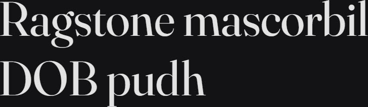

# Synopsis: Fraunces

Display, "Old Style" soft-serif typeface inspired by the mannerisms of early 20th century typefaces such as Windsor, Souvenir, and the Cooper Series. Variable font with four axes including Softness and Wonky for expressive, customisable display typography.

## Key Characteristics

- **Classification:** Display "Old Style" soft-serif
- **Character:** Wonky, goofy, playful, elegant and a workhorse; hand-drawn quality with both heavy inky and thinner refined qualities; leaning h, n, m glyphs and flagged ball terminals on italics
- **Intended use:** Display typography (text and display)
- **Family:** Standalone family — no sibling sans or small caps companions
- **Adoption (2026-05-05):** 115M weekly serves, 49,700+ websites

## Technical

- **Variable font (4):** Softness (`SOFT`) 0–100, Wonky (`WONK`) 0–1, Optical Size (`opsz`) 9–144, Weight (`wght`) 100–900
- **Weights:** 100–900 (variable)
- **Styles:** Normal + Italic

## Kupferschmid Matrix

Classified from visual examination of 

| Layer | Classification | Evidence |
| :---- | :------------- | :------- |
| 1 Skeleton | Rational | Vertical stress on o/O, closed apertures on a/e/s/c, constructed (non-circular) bowls on b/d/p |
| 2 Flesh | Contrast Serif | Dramatic thick-thin stroke variation on o/a/g/D/O/B, fine hairline serifs throughout |
| 3 Skin | Soft-serif Didone-style | Sharp hairline serifs with subtle bracketing, double-storey a and g, ball terminal on r with calligraphic warmth from the soft-serif old-style heritage |

## References

Curated from:

- https://fonts.google.com/specimen/Fraunces/about
- https://raw.githubusercontent.com/google/fonts/main/ofl/fraunces/METADATA.pb

Classified using:

- [kupferschmid-matrix.md](../references/kupferschmid-matrix.md)
