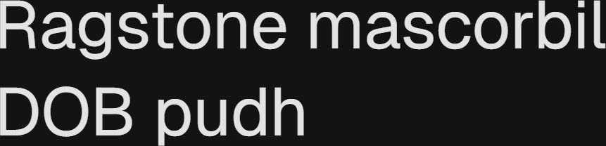

# Synopsis: Geist

Geometric sans-serif typeface designed to complement its monospace counterpart, Geist Mono. Created by Vercel in collaboration with Basement Studio, drawing inspiration from the Swiss design movement with a clean, modern aesthetic. Ideal for headlines, logos, posters, and other large display sizes.

## Key Characteristics

- **Classification:** Geometric sans-serif
- **Character:** Clean, modern aesthetic embodying simplicity, minimalism, and speed; precision, clarity, and functionality at its core
- **Intended use:** Display — headlines, logos, posters, and other large display sizes
- **Family:** Has a sibling monospace companion — [Geist Mono](https://fonts.google.com/specimen/Geist+Mono)
- **Adoption (2026-05-05):** 110M weekly serves, 11,200+ websites

## Technical

- **Variable font (1):** Weight (`wght`) 100–900
- **Weights:** 400 (variable axis 100–900)
- **Styles:** Normal + Italic

## Kupferschmid Matrix

Classified from visual examination of 

| Layer | Classification | Evidence |
| :---- | :------------- | :------- |
| 1 Skeleton | Geometric | Circular bowls on b/d/p/o, perfectly vertical axis on o/O, single-storey g with simple loop, simple cross-shaped t |
| 2 Flesh | Linear Sans | Uniform stroke weight on curves and stems, no serifs |
| 3 Skin | Modern minimal geometric | Precise circular bowls, flat-cut horizontal terminals on r/c, single-storey g with open tail, compact ascenders and short descenders |

## References

Curated from:

- https://fonts.google.com/specimen/Geist/about
- https://raw.githubusercontent.com/google/fonts/main/ofl/geist/METADATA.pb

Classified using:

- [kupferschmid-matrix.md](../references/kupferschmid-matrix.md)
