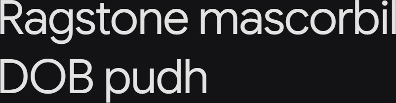

# Synopsis: Google Sans Flex

Google Sans Flex is the next generation of Google's brand typeface. Designed as an extremely flexible variable font, it introduces variable axes for weight, width, optical size, slant, as well as an axis for rounded terminals.

## Key Characteristics

- **Classification:** Sans serif (Google brand typeface)
- **Character:** Extremely flexible variable font; the next generation of Google's brand typeface
- **Intended use:** Brand typeface (per Google)
- **Family:** Google brand typeface — sibling/companion families not documented on the about page
- **Adoption (2026-04-27):** 184M weekly serves, 2,500+ websites

## Technical

- **Variable font (5 axes mentioned):** Weight (`wght`), Width (`wdth`), Optical size (`opsz`), Slant (`slnt`), and an axis for rounded terminals
- **Weights:** Not available — Google Sans Flex is a Google brand typeface and is not hosted at the standard `ofl/googlesansflex/METADATA.pb` path in the open `google/fonts` repository, so the explicit weight list could not be retrieved
- **Styles:** Not available from the about page; precise numeric axis ranges are not documented because the font is not in the open `google/fonts` OFL repository

## Kupferschmid Matrix

Classified from visual examination of 

| Layer | Classification | Evidence |
| :---- | :------------- | :------- |
| 1 Skeleton | Geometric | Circular bowls on o/O/b/d/p, no visible stress axis, simple constructed t — apertures on a/e/s are mildly open (humanist softening) but construction dominates |
| 2 Flesh | Linear Sans | Uniform stroke weight across curved letters (a/o/e/g), no serifs |
| 3 Skin | Rounded humanist geometric | Soft rounded terminals on r/c/e, double-storey a softens pure geometry, evenly circular bowls on o/b/d/p with round tittle on i |

## References

Curated from:

- https://fonts.google.com/specimen/Google+Sans+Flex/about

Note: `https://raw.githubusercontent.com/google/fonts/main/ofl/googlesansflex/METADATA.pb` is genuinely unavailable — Google Sans Flex is a Google brand typeface, not hosted at the standard OFL path in the open `google/fonts` repository.

Classified using:

- [kupferschmid-matrix.md](../references/kupferschmid-matrix.md)
