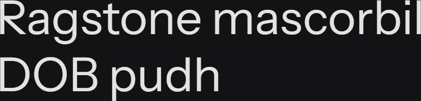

# Synopsis: Instrument Sans

Variable sans-serif designed for the Instrument brand by Rodrigo Fuenzalida and Jordan Egstad. Balances precision with subtle notes of playfulness, drawing inspiration from neo-grotesques while featuring contemporary characteristics.

## Key Characteristics

- **Classification:** Sans serif (neo-grotesque inspired)
- **Character:** Balances an abundance of precision with subtle notes of playfulness; orchestration of favourite qualities in a sans-serif with contemporary characteristics
- **Intended use:** Expressive messaging — 12 unique stylistic sets allow common characters to be replaced with alternate glyphs to tailor appearance and legibility
- **Family:** Standalone family — no sibling serif or small caps companions
- **Adoption (2026-05-05):** 128M weekly serves, 79,700+ websites

## Technical

- **Variable font (2):** Width (`wdth`) 75–100, Weight (`wght`) 400–700
- **Weights:** 400–700 (variable range)
- **Styles:** Normal + Italic

## Kupferschmid Matrix

Classified from visual examination of 

| Layer | Classification | Evidence |
| :---- | :------------- | :------- |
| 1 Skeleton | Rational | Closed apertures on a/e/s/c, vertical stress on o/O, upright construction with squared bowls on b/d/p |
| 2 Flesh | Linear Sans | Uniform stroke weight with no thick-thin variation, no serifs |
| 3 Skin | Compact mechanical grotesque | Narrow proportions with short ascenders/descenders, square tittle on i, flat-cut blunt terminals on c/s/r |

## References

Curated from:
- https://fonts.google.com/specimen/Instrument+Sans/about
- https://raw.githubusercontent.com/google/fonts/main/ofl/instrumentsans/METADATA.pb

Classified using:
- [kupferschmid-matrix.md](../references/kupferschmid-matrix.md)
