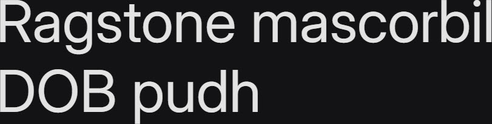

# Synopsis: Inter

Variable font family carefully crafted and designed for computer screens. Features a tall x-height to aid in readability of mixed-case and lower-case text, with several OpenType features including contextual alternates, slashed zero, and tabular numbers.

## Key Characteristics

- **Classification:** Sans serif
- **Character:** Tall x-height for readability of mixed-case and lower-case text; designed for computer screens with OpenType features like contextual alternates (punctuation adjusts to surrounding glyphs), slashed zero, and tabular numbers
- **Intended use:** Computer screens
- **Family:** Standalone family — no sibling serif or small caps companions
- **Adoption (2026-04-22):** 13.4B weekly serves, 2.38M+ websites

## Technical

- **Variable font (2):** Optical size (`opsz`) 14–32, Weight (`wght`) 100–900
- **Weights:** 100–900 (variable)
- **Styles:** Normal + Italic

## Kupferschmid Matrix

Classified from visual examination of 

| Layer | Classification | Evidence |
|:---|:---|:---|
| 1 Skeleton | Rational | Closed apertures on a/e/s/c, vertical stress on o/O, non-circular bowls on b/d/p |
| 2 Flesh | Linear Sans | Uniform stroke weight across curves and stems, no serifs |
| 3 Skin | Tall-x neo-grotesque | Very tall x-height with short ascenders/descenders, flat-cut horizontal terminals on c/s/r/t, double-storey a and g with round tittle |

## References

Curated from:

- https://fonts.google.com/specimen/Inter/about
- https://raw.githubusercontent.com/google/fonts/main/ofl/inter/METADATA.pb

Classified using:

- [kupferschmid-matrix.md](../references/kupferschmid-matrix.md)
