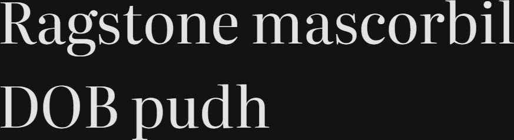

# Synopsis: Literata

Distinct variable serif family for digital text, now in its third version. Originally created as the brand typeface for Google Play Books, it has matured into a full digital publishing toolbox covering headline, paragraph, and caption text across any device, screen resolution, or font size.

## Key Characteristics

- **Classification:** Variable serif for digital publishing
- **Character:** Designed for comfortable reading on any device; covers headline, paragraph, and caption use; "the every-device font"
- **Intended use:** Digital text — headline, paragraph, and caption
- **Family:** Standalone family — print version (separate ebook version also exists)
- **Adoption (2026-03-27):** 65.2M weekly serves, 60,400+ websites

## Technical

- **Variable font (2):** Optical Size (`opsz`) 7–72, Weight (`wght`) 200–900
- **Styles:** Normal + Italic (both variable)
- **Scripts:** Latin, Cyrillic, Greek (+ extended and Vietnamese)

## Kupferschmid Matrix

Classified from visual examination of 

| Layer | Classification | Evidence |
|:---|:---|:---|
| 1 Skeleton | Dynamic | Open apertures on a/e/s/c, diagonal stress on o/O, organic calligraphic bowl construction |
| 2 Flesh | Contrast Serif | Pronounced thick-thin stroke variation in curved strokes; refined bracketed serifs throughout |
| 3 Skin | Tall-contrast bracketed serif | Tall ascenders relative to x-height (b/d/h); dramatic contrast in a/o/D/O; double-storey a and g with closed bowls, wedge-cut ascender serifs, round teardrop terminals on r |

## References

Curated from:

- https://fonts.google.com/specimen/Literata/about
- https://raw.githubusercontent.com/google/fonts/main/ofl/literata/METADATA.pb

Classified using:

- [kupferschmid-matrix.md](../references/kupferschmid-matrix.md)
