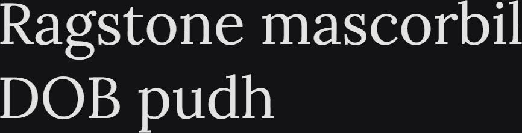

# Synopsis: Lora

Well-balanced contemporary serif with roots in calligraphy. Moderate contrast typeface with brushed curves and driving serifs, optimised for screen and equally suited for print.

## Key Characteristics

- **Classification:** Contemporary calligraphic serif
- **Character:** Brushed curves contrasted with driving serifs; conveys the mood of a modern-day story or art essay
- **Intended use:** Body text
- **Family:** Standalone family — no sibling sans or small caps companions
- **Adoption (2026-03-22):** 889M weekly serves, 2.01M+ websites

## Technical

- **Variable font (1):** Weight (`wght`) 400–700
- **Weights:** 400, 500, 600, 700
- **Styles:** Normal + Italic at each weight

## Kupferschmid Matrix

Classified from visual examination of 

| Layer | Classification | Evidence |
| :---- | :------------- | :------- |
| 1 Skeleton | Dynamic | Open apertures on a/e/s, diagonal stress on o, calligraphic construction |
| 2 Flesh | Contrast Serif | Moderate thick-thin stroke variation, bracketed serifs |
| 3 Skin | Contemporary calligraphic | Brushed curve transitions, driving serifs, distinctive R leg |

## References

Curated from:

- https://fonts.google.com/specimen/Lora/about
- https://raw.githubusercontent.com/google/fonts/main/ofl/lora/METADATA.pb

Classified using:

- [kupferschmid-matrix.md](../references/kupferschmid-matrix.md)
