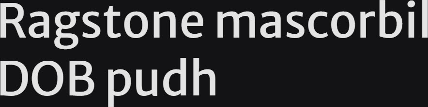

# Synopsis: Merriweather Sans

Low-contrast semi-condensed sans-serif text typeface designed to be pleasant to read at very small sizes. Traditional in feeling despite modern shapes adopted for screens.

## Key Characteristics

- **Classification:** Semi-condensed sans serif
- **Character:** Large x-height, slightly condensed letterforms, mild diagonal stress, open forms; traditional feeling despite modern screen-optimised shapes
- **Intended use:** Body text at small sizes
- **Family:** Has serif sibling — [Merriweather](https://fonts.google.com/specimen/Merriweather)
- **Adoption (2026-03-23):** 179M weekly serves, 370,000+ websites

## Technical

- **Variable font (1):** Weight (`wght`) 300–800
- **Weights:** 300, 400, 500, 600, 700, 800
- **Styles:** Normal + Italic at each weight

## Kupferschmid Matrix [TO BE COMPLETED]

## References

Curated from:

- https://fonts.google.com/specimen/Merriweather+Sans/about
- https://raw.githubusercontent.com/google/fonts/main/ofl/merriweathersans/METADATA.pb
