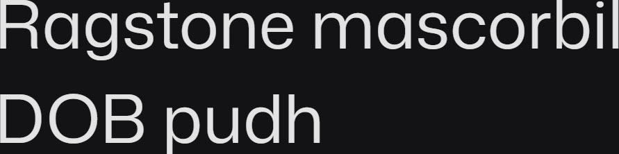

# Synopsis: Mona Sans

A strong and versatile sans serif inspired by industrial-era grotesques, designed together with Degarism. Works well across product, web, and print, and pairs with its sidekick Hubot Sans.

## Key Characteristics

- **Classification:** Sans serif (industrial-era grotesque inspired)
- **Character:** Strong and versatile; inspired by industrial-era grotesques
- **Intended use:** Product, web, and print
- **Family:** Companion to sibling sans Hubot Sans
- **Adoption (2026-05-05):** 24.8M weekly serves, 5,600+ websites

## Technical

- **Variable font (2):** Width (`wdth`) 75–125, Weight (`wght`) 200–900
- **Weights:** 200, 300, 400, 500, 600, 700, 800, 900
- **Styles:** Normal + Italic at each weight

## Kupferschmid Matrix

Classified from visual examination of 

| Layer | Classification | Evidence |
| :---- | :------------- | :------- |
| 1 Skeleton | Rational | Closed apertures on a/e/s/c, vertical stress on o/O, fairly upright neo-grotesque construction |
| 2 Flesh | Linear Sans | Very uniform stroke weight on curves of a/g/o/e, no serifs |
| 3 Skin | Modern neo-grotesque | Single-storey g with open tail, clean-cut horizontal terminals on r/s/c, tall ascenders on b/d/h with smooth high-junction arches on n/h/m |

## References

Curated from:
- https://fonts.google.com/specimen/Mona+Sans/about
- https://raw.githubusercontent.com/google/fonts/main/ofl/monasans/METADATA.pb

Classified using:
- [kupferschmid-matrix.md](../references/kupferschmid-matrix.md)
