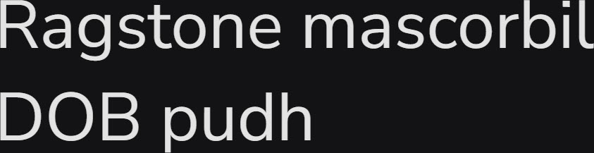

# Synopsis: Nunito Sans

Well-balanced sans serif typeface, the non-rounded terminal companion to Nunito. Originally created by Vernon Adams as a rounded terminal sans serif for display typography, with Jacques Le Bailly extending it to a full set of weights and adding the regular non-rounded terminal Nunito Sans version. Upgraded to a variable font in February 2023 with four axes.

## Key Characteristics

- **Classification:** Sans serif
- **Character:** Well-balanced, regular non-rounded terminal companion to the rounded-terminal Nunito; suited for display typography
- **Intended use:** Display typography
- **Family:** Part of the Nunito superfamily — sibling to [Nunito](/specimen/Nunito) (rounded terminal version)
- **Adoption (2026-04-27):** 1.67B weekly serves, 1.68M+ websites

## Technical

- **Variable font (4):** Ascenders High (`YTLC`) 440–540, Optical Size (`opsz`) 6–12, Width (`wdth`) 75–125, Weight (`wght`) 200–1000
- **Weights:** 200–1000 (variable range)
- **Styles:** Normal + Italic

## Kupferschmid Matrix

Classified from visual examination of 

| Layer | Classification | Evidence |
| :---- | :------------- | :------- |
| 1 Skeleton | Geometric | Circular bowls on b/d/p/o, vertical stress on O, single-storey g, simple cross-form t — apertures on a/c/s are moderate (humanist-tinged) but circular construction dominates |
| 2 Flesh | Linear Sans | Uniform stroke weight on all curves, no contrast, no serifs |
| 3 Skin | Balanced rounded geometric | Tall ascenders on b/d/h, flat-cut terminals on s/c, smooth rounded arches on n/m, double-storey a + single-storey g pairing — distinguishes it from its rounded-terminal sibling Nunito |

## References

Curated from:
- https://fonts.google.com/specimen/Nunito+Sans/about
- https://raw.githubusercontent.com/google/fonts/main/ofl/nunitosans/METADATA.pb

Classified using:
- [kupferschmid-matrix.md](../references/kupferschmid-matrix.md)
