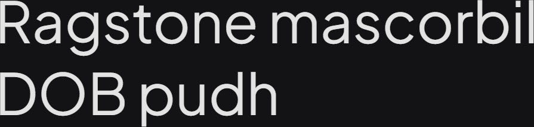

# Synopsis: Plus Jakarta Sans

A fresh take on geometric sans serif styles, designed by Gumpita Rahayu of Tokotype. Originally commissioned by 6616 Studio for the Jakarta Provincial Government's _+Jakarta City of Collaboration_ identity in 2020. Takes inspiration from Neuzeit Grotesk, Futura, and 1930s grotesque sans serifs with almost monolinear contrast and pointy curves.

## Key Characteristics

- **Classification:** Geometric sans serif
- **Character:** Modern and clean cut forms with almost monolinear contrast and pointy curves; slightly taller x-height for clear spaces between caps and x-height; open counters and balanced spaces preserve legibility at a large range of sizes
- **Intended use:** Display and body text
- **Family:** Standalone family — no sibling serif or small caps companions
- **Adoption (2026-05-05):** 625M weekly serves, 261,000+ websites

## Technical

- **Variable font (1):** Weight (`wght`) 200–800
- **Weights:** 200, 300, 400, 500, 600, 700, 800
- **Styles:** Normal + Italic at each weight

## Kupferschmid Matrix

Classified from visual examination of 

| Layer | Classification | Evidence |
| :---- | :------------- | :------- |
| 1 Skeleton | Geometric | Circular O/o/b/d/p bowls, vertical stress, constructed letter shapes, simple cross-like t |
| 2 Flesh | Linear Sans | Nearly monolinear stroke weight across curves and stems, no serifs |
| 3 Skin | Pointy-curve modern grotesque | Pointy curve transitions where strokes meet bowls (a/d/p/b), tall x-height with shorter ascenders, double-storey a and g |

## References

Curated from:
- https://fonts.google.com/specimen/Plus+Jakarta+Sans/about
- https://raw.githubusercontent.com/google/fonts/main/ofl/plusjakartasans/METADATA.pb

Classified using:
- [kupferschmid-matrix.md](../references/kupferschmid-matrix.md)
