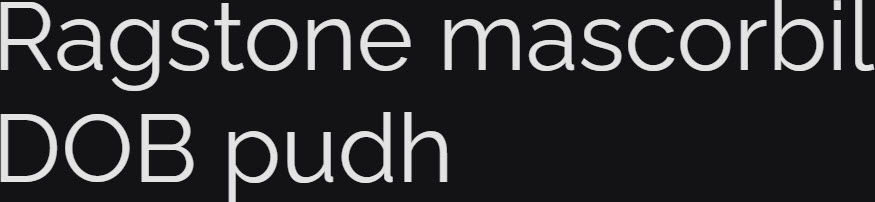

# Synopsis: Raleway

Elegant sans-serif typeface family. Initially a single thin weight, expanded into a 9-weight family. A display face with a neo-grotesque inspired default character set and a stylistic alternate inspired by more geometric sans-serifs.

## Key Characteristics

- **Classification:** Sans-serif (neo-grotesque with geometric alternates)
- **Character:** Elegant and clean; includes old style and lining numerals, standard and discretionary ligatures, a complete set of diacritics
- **Intended use:** Display / headings
- **Family:** Sister family [Raleway Dots](https://fonts.google.com/specimen/Raleway+Dots)
- **Adoption (2026-03-22):** 2.19B weekly serves, 5.07M+ websites

## Technical

- **Variable font (1):** Weight (`wght`) 100–900
- **Weights:** 100, 200, 300, 400, 500, 600, 700, 800, 900
- **Styles:** Normal + Italic at each weight

## Kupferschmid Matrix

Classified from visual examination of 

| Layer | Classification | Evidence |
| :---- | :------------- | :------- |
| 1 Skeleton | Quite Geometric | Circular bowls on O/o/b/d/p and vertical stress on O pull Geometric/Rational; closed apertures on a/e/s/c reinforce Rational, but constructed circular shapes dominate |
| 2 Flesh | Linear Sans | Uniform stroke weight throughout, no serifs |
| 3 Skin | Elegant geometric display | Tall elegant proportions with long ascenders on b/d/h; round circular O bowls; double-storey a and g with cleanly cut terminals on c/s |

## References

Curated from:

- https://fonts.google.com/specimen/Raleway/about
- https://raw.githubusercontent.com/google/fonts/main/ofl/raleway/METADATA.pb

Classified using:

- [kupferschmid-matrix.md](../references/kupferschmid-matrix.md)
