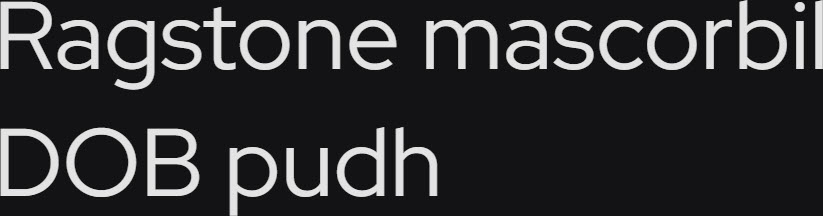

# Synopsis: Red Hat Display

A fresh take on the geometric sans genre, drawing inspiration from a range of American sans serifs including Tempo and Highway Gothic. The Display styles are low contrast and spaced tightly, with a large x-height and open counters. Originally commissioned by Paula Scher, Pentagram and designed by Jeremy Mickel, MCKL for the Red Hat identity.

## Key Characteristics

- **Classification:** Geometric sans serif (display)
- **Character:** Low contrast, tightly spaced, large x-height, open counters; designed for display use
- **Intended use:** Display / headlines (pairs seamlessly with Red Hat Text for body)
- **Family:** Part of the Red Hat superfamily — Red Hat Display (display optical size), Red Hat Text (text optical size), and a monospace style
- **Adoption (2026-04-22):** 244M weekly serves, 101,000+ websites

## Technical

- **Variable font (1):** Weight (`wght`) 300–900
- **Weights:** Light to Bold (weight axis Light–Bold upgraded June 2021; November 2024 update refined Medium and SemiBold weight distribution)
- **Styles:** Normal + Italic

## Kupferschmid Matrix

Classified from visual examination of 

| Layer | Classification | Evidence |
| :---- | :------------- | :------- |
| 1 Skeleton | Geometric | Circular bowls on o/b/d/p, vertical axis on O, constructed shapes, simple cross-shaped t |
| 2 Flesh | Linear Sans | Very uniform stroke weight (low contrast), no serifs |
| 3 Skin | Tight geometric display | Large x-height with short ascenders/descenders, flat-cut terminals on c/r, double-storey a and g |

## References

Curated from:

- https://fonts.google.com/specimen/Red+Hat+Display/about
- https://raw.githubusercontent.com/google/fonts/main/ofl/redhatdisplay/METADATA.pb

Classified using:

- [kupferschmid-matrix.md](../references/kupferschmid-matrix.md)
