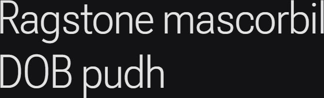

# Synopsis: Roboto Flex

Highly flexible variable sans serif typeface, developed by Font Bureau for Google as the latest step forward in the Roboto superfamily. Built around an extreme range of weights, widths, grades, and optical sizes plus parametric axes for fine-tuning, with special emphasis on large-screen capabilities.

## Key Characteristics

- **Classification:** Sans serif (variable, parametric)
- **Character:** Super scalable, adaptable, customizable, and optimizable; designed to "flex" across devices, viewports, and screen sizes; supports high-quality justification and dark-mode typography via parametric axes
- **Intended use:** Universal — print and digital media, with emphasis on deep typographic hierarchies and large-screen layouts
- **Family:** Part of the Roboto superfamily (alongside Roboto, Roboto Condensed, Roboto Slab, Roboto Mono, Roboto Serif)
- **Adoption (2026-04-27):** 278M weekly serves, 50,800+ websites

## Technical

- **Variable font (13):** Grade (`GRAD`) -200–150, X Opaque (`XOPQ`) 27–175, X Transparent (`XTRA`) 323–603, Y Opaque (`YOPQ`) 25–135, Y Transparent Ascender (`YTAS`) 649–854, Y Transparent Descender (`YTDE`) -305–-98, Y Transparent Figure (`YTFI`) 560–788, Y Transparent Lowercase (`YTLC`) 416–570, Y Transparent Uppercase (`YTUC`) 528–760, Optical Size (`opsz`) 8–144, Slant (`slnt`) -10–0, Width (`wdth`) 25–151, Weight (`wght`) 100–1000
- **Weights:** 100–1000 (continuous)
- **Styles:** Normal + Slant axis (-10 to 0)

## Kupferschmid Matrix

Classified from visual examination of 

| Layer | Classification | Evidence |
| :---- | :------------- | :------- |
| 1 Skeleton | Rational | Closed apertures on a/s, vertical stress on o/O, slightly squared bowls on b/d/p |
| 2 Flesh | Linear Sans | Highly uniform stroke weight across curves, no serifs |
| 3 Skin | Neutral mechanical humanist | Double-storey a/g with closed loops, flat-cut terminal on c, slight humanist warmth from curled r ear and parametric engineered proportions |

## References

Curated from:

- https://fonts.google.com/specimen/Roboto+Flex/about
- https://raw.githubusercontent.com/google/fonts/main/ofl/robotoflex/METADATA.pb

Classified using:

- [kupferschmid-matrix.md](../references/kupferschmid-matrix.md)
