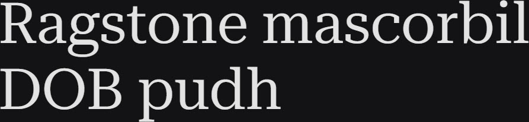

# Synopsis: Roboto Serif

Variable typeface family designed to create a comfortable and frictionless reading experience. Minimal and highly functional, useful anywhere (even for app interfaces) due to the extensive set of weights and widths across a broad range of optical sizes. Carefully crafted to work well in digital media, across the full scope of sizes and resolutions, and equally comfortable in print. The newest member of the Roboto superfamily.

## Key Characteristics

- **Classification:** Serif
- **Character:** Minimal and highly functional; designed for comfortable, frictionless reading at any size and in any format
- **Intended use:** Body text, UI, app interfaces — universal across digital and print
- **Family:** Part of the Roboto superfamily (sibling to Roboto sans)
- **Adoption (2026-03-27):** 79.3M weekly serves, 71,900+ websites

## Technical

- **Variable font (4):** Grade (`GRAD`) −50–100, Optical Size (`opsz`) 8–144, Width (`wdth`) 50–150, Weight (`wght`) 100–900
- **Styles:** Normal + Italic

## Kupferschmid Matrix

Classified from visual examination of 

| Layer | Classification | Evidence |
| :---- | :------------- | :------- |
| 1 Skeleton | Quite Rational | Vertical stress on o/O, but moderate (not tightly closed) apertures on a/e/s — stress pulls Rational, apertures resist full Rational |
| 2 Flesh | Contrast Serif | Moderate thick-thin stroke variation, bracketed serifs |
| 3 Skin | Functional engineered | Restrained bracketed serifs, double-storey a/g, wide clean proportions for digital clarity |

## References

Curated from:

- https://fonts.google.com/specimen/Roboto+Serif/about
- https://raw.githubusercontent.com/google/fonts/main/ofl/robotoserif/METADATA.pb

Classified using:

- [kupferschmid-matrix.md](../references/kupferschmid-matrix.md)
