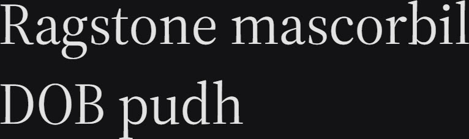

# Synopsis: Source Serif 4

Transitional serif typeface designed by Frank Grießhammer to complement the Source Sans Pro family. Loosely based on the work of Pierre Simon Fournier, it retains idiosyncrasies of Fournier's designs (such as the bottom serif on the b and middle serif on the w) while reworking them for a modern digital environment. Letter shapes are simplified and highly readable, suited for extended text on screen or paper.

## Key Characteristics

- **Classification:** Transitional serif
- **Character:** Simplified, highly readable letter shapes with historical Fournier roots; strong typographic colour matched to Source Sans Pro
- **Intended use:** Body text — extended reading on screen and print
- **Family:** Superfamily — companion to Source Sans Pro (designed by Paul Hunt; both consulted by Robert Slimbach)
- **Adoption (2026-03-27):** 171M weekly serves, 24,400+ websites

## Technical

- **Variable font (2):** Optical size (`opsz`) 8–60, Weight (`wght`) 200–900
- **Weights:** 200–900 (continuous via variable axis)
- **Styles:** Normal + Italic

## Kupferschmid Matrix

Classified from visual examination of 

| Layer | Classification | Evidence |
|:---|:---|:---|
| 1 Skeleton | Dynamic | Open apertures on a/e/s, subtle diagonal stress on o/O, organic pen-derived construction |
| 2 Flesh | Contrast Serif | Moderate thick-thin stroke variation, bracketed serifs |
| 3 Skin | Refined transitional | Smoothly bracketed serifs with fine terminals, double-storey a and g, historical Fournier character in clean digital form |

## References

Curated from:

- <https://fonts.google.com/specimen/Source+Serif+4/about>
- <https://raw.githubusercontent.com/google/fonts/main/ofl/sourceserif4/METADATA.pb>

Classified using:

- [kupferschmid-matrix.md](../references/kupferschmid-matrix.md)
