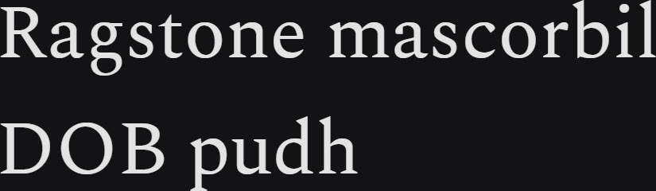

# Synopsis: Spectral

Versatile serif typeface designed by Production Type and commissioned by Google Fonts. Intended primarily for text-rich, screen-first environments and long-form reading, with seven weights of roman and italic plus small caps.

## Key Characteristics

- **Classification:** Serif
- **Character:** Efficient, beautiful design intended for text-rich, screen-first environments and long-form reading; unobtrusive and transparent
- **Intended use:** Body text — text-rich, screen-first environments and long-form reading
- **Family:** Standalone family — no sibling sans companions; includes small caps
- **Adoption (2026-04-29):** 91.8M weekly serves, 134,000+ websites

## Technical

- **Weights:** 200, 300, 400, 500, 600, 700, 800
- **Styles:** Normal + Italic at each weight
- **Features:** Small caps

## Kupferschmid Matrix

Classified from visual examination of 

| Layer | Classification | Evidence |
| :---- | :------------- | :------- |
| 1 Skeleton | Quite Rational | Near-vertical stress on o/O with only a faint diagonal lean, moderate (not wide) apertures on a/e/c/s, narrow refined proportions on b/d/p — stress and proportions pull Rational, residual aperture warmth pulls slightly Dynamic |
| 2 Flesh | Contrast Serif | Moderate thick-thin modulation visible on o/a/g/e curves, fine bracketed serifs at stems and baseline |
| 3 Skin | Refined screen-text serif | Tall ascenders on b/d/h/l exceeding cap height, double-storey a and g with shallow upper bowls, crisp bracketed serifs with subtle ball terminal on r — narrow proportions tuned for long-form on-screen reading |

## References

Curated from:
- https://fonts.google.com/specimen/Spectral/about
- https://raw.githubusercontent.com/google/fonts/main/ofl/spectral/METADATA.pb

Classified using:
- [kupferschmid-matrix.md](../references/kupferschmid-matrix.md)
