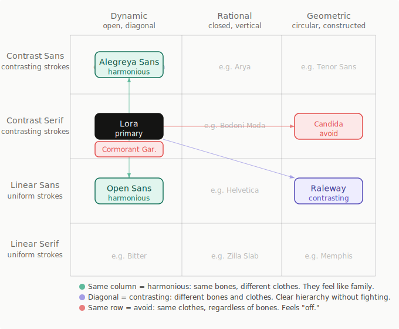

# Plugin: Find My Font

Research, classify, and recommend Google Font pairings using the [Kupferschmid font matrix](https://fonts.google.com/knowledge/choosing_type/pairing_typefaces_based_on_their_construction_using_the_font_matrix) — a three-layer classification system (skeleton, flesh, skin) for choosing typefaces that work together.

Give it a primary body font, optional candidates, and a mood or criteria. It fetches font data, classifies each font on the matrix, evaluates pairings, and recommends fonts that match your brief.

## What's Inside - Skills

| Command | What it does |
|---|---|
| `/find-my-font` | Orchestrator — parses brief, launches workers, evaluates pairings, outputs recommendations |
| `/find-my-font:curate-font` | Fetches font data from Google Fonts and writes a structured font profile |
| `/find-my-font:classify-font-matrix` | Examines a specimen image and classifies the font on the Kupferschmid matrix |
| `/find-my-font:create-svg-matrix` | Creates an SVG visualisation with font cards and pairing arrows |

All four skills are independently invocable.

## Usage

**Orchestrator:**

- `/find-my-font` primary: Lora, candidates: Jost, Open Sans. I want quiet luxury.
- `/find-my-font` primary: Merriweather Sans @merriweather-sans.jpg, constrain to Shopify fonts
- `/find-my-font` primary: Newsreader (recommend alternatives for editorial blog)
- `/find-my-font` primary: Lora, candidates: Cormorant Garamond, Jost. Clean luxury. Make an SVG.

**Individual skills:**

- `/find-my-font:curate-font` Lora
- `/find-my-font:classify-font-matrix` Raleway
- `/find-my-font:create-svg-matrix` primary: Lora (Dynamic, Contrast Serif). Candidates: Jost (Geometric, Linear Sans) — diagonal contrasting pair; Source Sans 3 (Dynamic, Linear Sans) — same column harmonious pair.

## Reference Files

| File | Skills That Reference | Purpose / Explanation |
|---|---|---|
| [`kupferschmid-matrix.md`](references/kupferschmid-matrix.md) | [find-my-font](skills/find-my-font/SKILL.md), [classify-font-matrix](skills/classify-font-matrix/SKILL.md) | Font classification framework for compatible aesthetic pairing |
| [`example-output.md`](skills/find-my-font/references/example-output.md) | [find-my-font](skills/find-my-font/SKILL.md) | Sample output — Claude adapts format relative to fonts and use case |
| [`kupferschmid-matrix-template.svg`](skills/create-svg-matrix/references/kupferschmid-matrix-template.svg) | [create-svg-matrix](skills/create-svg-matrix/SKILL.md) | Clean SVG template Claude copies to visualise font matrix positions |
| [`shopify-fonts.md`](skills/find-my-font/references/shopify-fonts.md) | [find-my-font](skills/find-my-font/SKILL.md) | Fonts available on Shopify, a subset of Google Fonts. Shopify doesn't support `optical-size`, [requested](https://community.shopify.dev/t/pimp-my-type-please-support-variable-fonts-optical-sizing-axis/32509). |
| [`font-profiles/*.md`](font-profiles/) | [find-my-font](skills/find-my-font/SKILL.md), [curate-font](skills/curate-font/SKILL.md), [classify-font-matrix](skills/classify-font-matrix/SKILL.md) | Per-font research and matrix classification — created by curate, updated by classify |
| [`font-profiles/specimens/*.jpg`](font-profiles/specimens) | [classify-font-matrix](skills/classify-font-matrix/SKILL.md) | Font matrix classification requires visual inspection of font image specimens for accuracy |

## Matrix Visualisation

When requested, the skill copies the SVG template and edits it to place the analysed fonts on the matrix with colour-coded cards and directional arrows showing each pairing relationship.

<div align="center">
  <a href="skills/create-svg-matrix/references/kupferschmid-matrix-template.svg" target="_blank">
    
  </a>
  <p><em>Example: Lora (primary) with four candidates classified by matrix relationship — green for harmonious (same column), purple for contrasting (diagonal), red for avoid (same row/cell).</em></p>
</div>

## Dependencies

**Ref MCP (required)** — configured in [`.mcp.json`](.mcp.json). The skill fetches font data from Google Fonts specimen pages and GitHub METADATA.pb files via `ref_read_url`. This is not optional — Google Fonts is a JavaScript-heavy SPA that Claude's built-in `WebFetch` cannot read. Without Ref MCP, font curation will fail.

**Google Fonts only** — font research and classification relies on two dependable, structured sources (specimen page + METADATA.pb) that only exist for Google Fonts. This keeps curation fast and consistent. Supporting other catalogues would require web searching for equivalent data, which is slower and less reliable — but the skills could be extended for this if needed.

So Claude can render the SVG matrix to PNG, install `rsvg-convert`:

```bash
sudo apt install librsvg2-bin
```

## Future Improvements

- **Tighten recommendation output** — its very verbose, adjust [`example-output.md`](skills/find-my-font/references/example-output.md)
- **Python SVG generator** — a script that takes font card data and plots them onto the SVG template (cards and connectors), replacing manual SVG editing by Claude
