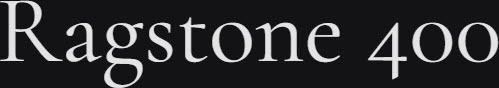

# Synopsis: Cormorant Garamond

Free display serif inspired by Claude Garamont's legacy. Ultra-high contrast with elegant, refined letterforms designed for large sizes. Part of the Cormorant super family spanning 9 visual styles.

## Key Characteristics

- **Classification:** Display serif (Garamond-inspired)
- **Character:** Ultra-high contrast, sharp elegant serifs, expressive calligraphic details — drawn from scratch with Garamond as a general impression rather than a direct reference
- **Intended use:** Display / headings (designed as a display face)
- **Family:** Cormorant super family — [Cormorant](https://fonts.google.com/specimen/Cormorant), [Cormorant Infant](https://fonts.google.com/specimen/Cormorant+Infant), [Cormorant SC](https://fonts.google.com/specimen/Cormorant+SC), [Cormorant Unicase](https://fonts.google.com/specimen/Cormorant+Unicase), [Cormorant Upright](https://fonts.google.com/specimen/Cormorant+Upright)
- **Adoption (2026-03-22):** 251M weekly Google Fonts serves, 420K+ websites

## Technical

- **Variable font (1):** Weight (`wght`) 300–700
- **Weights:** 300, 400, 500, 600, 700
- **Styles:** Normal + Italic at each weight

## Kupferschmid Matrix

- **Layer 1 Skeleton:** Dynamic (open apertures, diagonal stress, calligraphic construction — Garamond lineage)
- **Layer 2 Flesh:** Contrast Serif (very high thick-thin stroke variation, elegant bracketed serifs)
- **Confidence:** High — Garamond is the archetype of the Dynamic Contrast Serif position

## References

Summarised accurately from the sources below. For more detail, research these sources.

- <https://fonts.google.com/specimen/Cormorant+Garamond/about>
- <https://raw.githubusercontent.com/google/fonts/main/ofl/cormorantgaramond/METADATA.pb>
- `references/kupferschmid-matrix.md`
