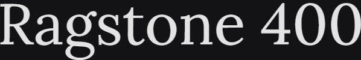

# Synopsis: Lora

Well-balanced contemporary serif with roots in calligraphy. Moderate contrast typeface with brushed curves and driving serifs, optimised for screen and equally suited for print.

## Key Characteristics

- **Classification:** Contemporary calligraphic serif
- **Character:** Brushed curves contrasted with driving serifs; conveys the mood of a modern-day story or art essay
- **Intended use:** Body text
- **Family:** Standalone family — no sibling sans or small caps companions
- **Adoption (2026-03-22):** 889M weekly serves, 2.01M+ websites

## Technical

- **Variable font (1):** Weight (`wght`) 400–700
- **Weights:** 400, 500, 600, 700
- **Styles:** Normal + Italic at each weight

## Kupferschmid Matrix

- **Layer 1 Skeleton:** Dynamic (open apertures, diagonal stress, calligraphic construction)
- **Layer 2 Flesh:** Contrast Serif (moderate thick-thin stroke variation, bracketed serifs)
- **Confidence:** High — calligraphic roots, brushed curves, and open forms are unambiguous

## References

Summarised accurately from the sources below. For more detail, research these sources.

- <https://fonts.google.com/specimen/Lora/about>
- <https://raw.githubusercontent.com/google/fonts/main/ofl/lora/METADATA.pb>
- `references/kupferschmid-matrix.md`
