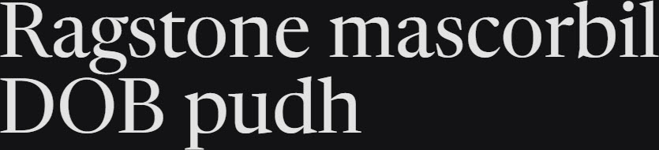

# Synopsis: Newsreader

Original typeface by Production Type, primarily intended for continuous on-screen reading in content-rich environments.

## Key Characteristics

- **Classification:** Serif for continuous reading
- **Character:** Designed for content-rich environments; refined and legible at sustained reading sizes
- **Intended use:** Body text, long-form on-screen reading
- **Family:** Standalone family — no sibling sans companion
- **Adoption (2026-03-23):** 78.4M weekly serves, 37,100+ websites

## Technical

- **Variable font (2):** Optical size (`opsz`) 6–72, Weight (`wght`) 200–800
- **Weights:** 200, 300, 400, 500, 600, 700, 800
- **Styles:** Normal + Italic at each weight

## Kupferschmid Matrix

- **Layer 1 Skeleton:** Quite Rational (vertical stress dominates, but apertures are open — mixed signals, similar to the Roboto Slab precedent in Kupferschmid's own examples)
- **Layer 2 Flesh:** Contrast Serif (pronounced thick-thin stroke variation, refined serifs)
- **Confidence:** Medium — borderline Dynamic/Rational; vertical stress and editorial character pull Rational, open apertures pull Dynamic

## References

Summarised accurately from the sources below. For more detail, research these sources.

- <https://fonts.google.com/specimen/Newsreader/about>
- <https://raw.githubusercontent.com/google/fonts/main/ofl/newsreader/METADATA.pb>
- `references/kupferschmid-matrix.md`
