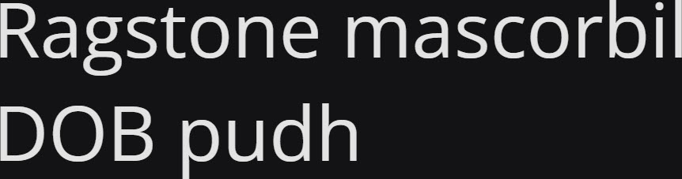

# Synopsis: Open Sans

Humanist sans serif typeface designed by Steve Matteson. Upright stress, open forms, and a neutral yet friendly appearance. Optimised for print, web, and mobile interfaces with excellent legibility.

## Key Characteristics

- **Classification:** Humanist sans serif
- **Character:** Upright stress, open forms, neutral yet friendly appearance; excellent legibility across print, web, and mobile
- **Intended use:** Universal — body text and UI
- **Family:** Standalone family — no sibling serif or small caps companions
- **Adoption (2026-03-23):** 41.9B weekly serves, 380M+ websites

## Technical

- **Variable font (2):** Width (`wdth`) 75–100, Weight (`wght`) 300–800
- **Weights:** 300, 400, 500, 600, 700, 800
- **Styles:** Normal + Italic at each weight

## Kupferschmid Matrix

Classified from visual examination of 

| Layer | Classification | Evidence |
|:---|:---|:---|
| 1 Skeleton | Quite Dynamic | Open apertures on a/e/s, but vertical stress on o — apertures pull Dynamic, stress pulls Rational |
| 2 Flesh | Linear Sans | Very uniform stroke weight, no serifs |
| 3 Skin | Wide clean-cut | Wide proportions, double-storey a and g, flat-cut terminals on r/s/c |

## References

Summarised accurately from the sources below. For more detail, research these sources.

- <https://fonts.google.com/specimen/Open+Sans/about>
- <https://raw.githubusercontent.com/google/fonts/main/ofl/opensans/METADATA.pb>
- `references/kupferschmid-matrix.md`
