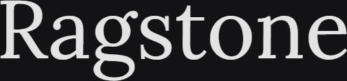
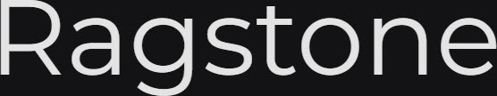
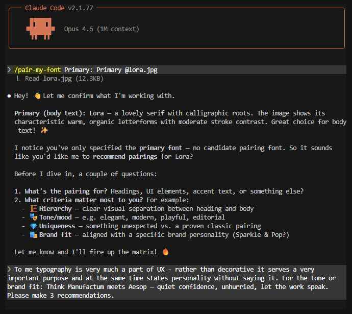
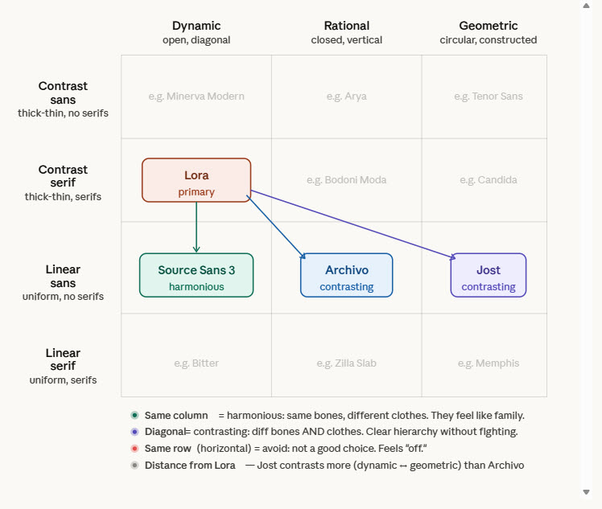

# pair-my-font

Evaluate whether two Google Fonts pair well using the Kupferschmid font matrix method, and optionally recommend alternative pairings.

## What's Inside

| Skill | Description |
| :---- | :---------- |
| `/pair-my-font` | Evaluate Google Font pairings using the three-layer font matrix (skeleton, flesh, skin) |

## Usage

```
/pair-my-font Primary: Lora, Candidate: Montserrat
/pair-my-font Primary: Lora @lora.jpg
```

Provide a primary body font (required) and an optional candidate pairing font. Attach font specimen images for more accurate letterform analysis (but Claude seems to work fine without anyhow). Use the word "Ragstone".

**Getting specimen images:** Visit `https://fonts.google.com/specimen/{FontName}`, type **Ragstone** in the preview field (it contains varied letter shapes useful for classification), and screenshot.

<div align="center">
  <a href="../../images/pair-my-font-lora.jpg" target="_blank">
    
  </a>
</div>

<div align="center">
  <a href="../../images/pair-my-font-montserrat.jpg" target="_blank">
    
  </a>
</div>

## In Action

Analysing **Lora** as the primary body font, with three heading font recommendations requested.

<div align="center">
  <a href="../../images/pair-my-font-eg-instruction.jpg" target="_blank">
    
  </a>
</div>

The skill classifies fonts and places them on the [Kupferschmid matrix](https://fonts.google.com/knowledge/choosing_type/pairing_typefaces_based_on_their_construction_using_the_font_matrix). Here's the matrix rendered in claude.ai for a prettier view — Claude Code produces the same analysis as markdown tables:

<div align="center">
  <a href="../../images/pair-my-font-eg-matrix-rendered.jpg" target="_blank">
    
  </a>
</div>

Below is part of the actual skill output. Adjust the SKILL itself for brevity.

### Recommendations

**Lora + Jost** — the Aesop pick

| | |
| :-- | :-- |
| **Relationship** | Diagonal — contrasting pair (Dynamic Serif to Geometric Sans) |
| **Why it works** | Maximum structural contrast: Lora's calligraphic warmth against Jost's Bauhaus-descended geometry. Different in every layer, so they create effortless hierarchy without competing. |
| **Best for** | Hero headings, brand statements, section titles |
| **Headings** | Weight `500`-`600`, tracking `-0.02em` to `-0.03em`. Semi-bold rather than bold — restraint is the point. |
| **Emotion** | *Curated simplicity. Objects chosen with intention, displayed without fuss.* |

**Lora + Source Sans 3** — the Manufactum pick

| | |
| :-- | :-- |
| **Relationship** | Same column — harmonious pair (both Dynamic) |
| **Why it works** | Shared skeleton: both have open apertures and diagonal stress. The difference is all in the flesh — Lora has contrast and serifs, Source Sans 3 is uniform and bare. They feel like the same voice at different volumes. |
| **Best for** | UI text, navigation, subheadings, captions — anywhere type should serve without drawing attention |
| **Headings** | Weight `600`, tracking `-0.01em`. Open proportions need less tightening. |
| **Emotion** | *Well-made things, honestly presented. The craft is in the detail you don't notice.* |

**Lora + Archivo** — the quiet authority pick

| | |
| :-- | :-- |
| **Relationship** | Diagonal — contrasting pair (Dynamic Serif to Rational Sans) |
| **Why it works** | Archivo brings vertical stress and slightly closed apertures — more structured than Source Sans 3, less constructed than Jost. A grotesque with "been here a while, no need to prove anything" quality. |
| **Best for** | Product titles, collection headers, editorial headlines — authoritative without corporate |
| **Headings** | Weight `500`-`600`, tracking `-0.02em`. Don't go heavier than `600` — the restraint is what makes it work. |
| **Emotion** | *A shopkeeper who knows every item by name. No rush. No pitch.* |

### Choose If

| Pick | If you want... |
| :-- | :-- |
| **Jost** | The clearest visual break between heading and body. Modern, minimal, intentional. |
| **Source Sans 3** | The typography to disappear completely. Maximum readability, zero personality clash. |
| **Archivo** | Something in between — more character than Source Sans 3, more restraint than Jost. |

---

*Example output generated on 2026/03/17 — output will vary.*
